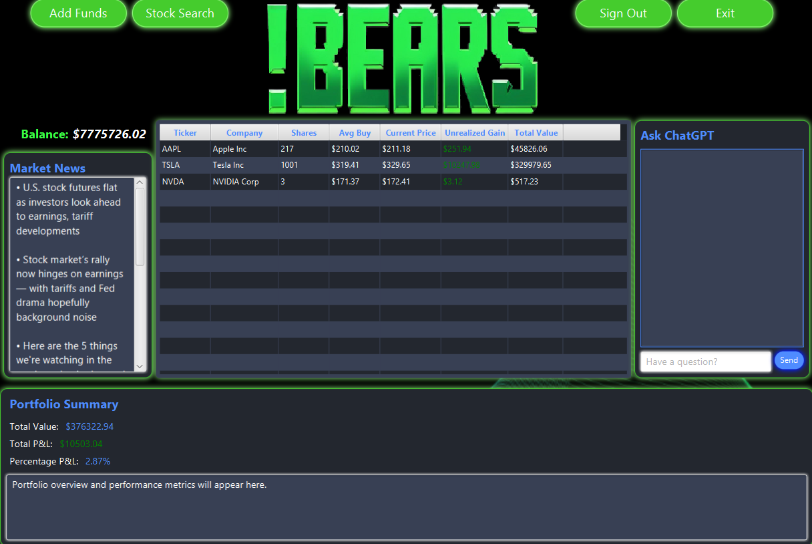

# 🐂 !Bears Portfolio Management System

A comprehensive JavaFX-based portfolio management application that enables users to track stock investments, view real-time market data, and interact with an AI-powered financial assistant.


## 📸 Screenshots

### Main Portfolio Dashboard


*Real-time portfolio tracking with live market data and ChatGPT integration*

### Stock Details View


*Detailed stock information with buy/sell functionality and company news*

### User Authentication


*Secure login interface*


*User registration with form validation*

## ✨ Features

### Core Functionality
- **🔐 User Authentication**: Secure registration and login with Firebase Authentication
- **📊 Portfolio Management**: Buy/sell stocks with real-time price tracking
- **📈 Real-time Market Data**: Live stock quotes and market news via Finnhub API
- **🤖 AI Assistant**: ChatGPT integration for financial advice and portfolio insights
- **📋 Transaction History**: Complete record of all buy/sell transactions
- **💰 Balance Management**: Virtual account balance for trading simulation
- **🔍 Stock Search**: Search and analyze individual stocks
- **📰 Market News**: Latest financial news and company-specific updates

### User Interface
- **🎨 Modern Design**: Clean, professional interface with responsive scaling
- **📱 Intuitive Navigation**: Easy-to-use controls and clear information display
- **🎯 Real-time Updates**: Live portfolio updates and price refreshes
- **💬 Chat Interface**: Built-in AI assistant for investment guidance

## 🏗️ Architecture

### Technology Stack
- **Frontend**: JavaFX 11+ with FXML
- **Backend**: Java 11+
- **Database**: Google Firestore (NoSQL)
- **Authentication**: Firebase Authentication
- **APIs**: 
  - Finnhub Stock API (real-time market data)
  - OpenAI GPT API (AI assistant)
- **Build Tool**: Maven/Gradle

### Design Patterns
- **MVC Architecture**: Clear separation between controllers, models, and views
- **Singleton Pattern**: User session management
- **Observer Pattern**: Real-time price updates
- **Factory Pattern**: Stock API service abstraction
- **Dependency Injection**: Service layer management

### Project Structure
```
src/
├── main/java/com/example/
│   ├── controllers/          # JavaFX Controllers
│   │   ├── MainPortfolioController.java
│   │   ├── SignInController.java
│   │   ├── RegistrationController.java
│   │   └── StockScreenController.java
│   ├── models/              # Data Models
│   │   ├── User.java
│   │   ├── Portfolio.java
│   │   ├── PortfolioEntry.java
│   │   ├── Stock.java
│   │   └── Transaction.java
│   ├── services/            # Business Logic
│   │   ├── UserAuth.java
│   │   ├── PortfolioIntegration.java
│   │   ├── FinnhubService.java
│   │   ├── ChatGPTClient.java
│   │   └── FirestoreDB.java
│   └── Driver.java          # Main Application
└── resources/
    ├── com/example/bearsfrontend/  # FXML Files
    ├── config.properties           # API Keys
    └── files/bearsKey.json        # Firebase Credentials
```

## 🚀 Getting Started

### Prerequisites
- Java 11 or higher
- JavaFX SDK
- Firebase account with Firestore enabled
- Finnhub API key
- OpenAI API key

### Installation

1. **Clone the repository**
   ```bash
   git clone https://github.com/yourusername/bears-portfolio.git
   cd bears-portfolio
   ```

2. **Set up Firebase**
   - Create a new Firebase project
   - Enable Firestore Database
   - Enable Authentication with Email/Password
   - Download the service account key and save as `src/main/resources/files/bearsKey.json`

3. **Configure API Keys**
   Create `src/main/resources/config.properties`:
   ```properties
   finnhub.api.key=YOUR_FINNHUB_API_KEY
   OPENAI_API_KEY=YOUR_OPENAI_API_KEY
   ```

4. **Build and Run**
   ```bash
   # Using Maven
   mvn clean compile
   mvn javafx:run
   
   # Using Gradle
   gradle build
   gradle run
   ```

### API Setup

#### Finnhub API
1. Sign up at [Finnhub.io](https://finnhub.io/)
2. Get your free API key
3. Add to `config.properties`

#### OpenAI API
1. Create account at [OpenAI](https://openai.com/)
2. Generate API key
3. Add to `config.properties`

## 📖 Usage Guide

### Getting Started
1. **Launch Application**: Run the main Driver class
2. **Create Account**: Click "New users click here!" to register
3. **Login**: Use your credentials to access the portfolio
4. **Add Funds**: Click "Add Funds" to add virtual money to your account

### Managing Your Portfolio
1. **Search Stocks**: Use the search bar to find stocks by ticker symbol
2. **View Details**: Double-click any holding to see detailed information
3. **Buy Stocks**: Enter ticker symbol, click "Buy" and specify quantity
4. **Sell Stocks**: Click "Sell" from stock details view
5. **Monitor Performance**: Track gains/losses in real-time

### Using the AI Assistant
1. **Ask Questions**: Type financial questions in the chat box
2. **Get Portfolio Insights**: Ask about your holdings for personalized advice
3. **Market Analysis**: Get AI-powered market commentary

## 🔧 Configuration

### Firebase Setup
```json
{
  "type": "service_account",
  "project_id": "your-project-id",
  "private_key_id": "...",
  "private_key": "...",
  "client_email": "...",
  "client_id": "...",
  "auth_uri": "https://accounts.google.com/o/oauth2/auth",
  "token_uri": "https://oauth2.googleapis.com/token"
}
```

### Firestore Collections Structure
```
users/
  {userId}/
    portfolio/
      main/
        - holdings: Array<PortfolioEntry>
        - transactions: Array<Transaction>
        - lastUpdated: Timestamp
    transactions/
      {transactionId}/
        - tickerSymbol: String
        - quantity: Number
        - pricePerShare: Number
        - isBuy: Boolean
        - timestamp: Timestamp
```

## 🧪 Testing

### Unit Tests
```bash
mvn test
```

### Manual Testing Checklist
- [ ] User registration and login
- [ ] Stock search functionality
- [ ] Buy/sell operations
- [ ] Portfolio calculations
- [ ] Real-time price updates
- [ ] AI chat functionality
- [ ] Balance management

## 🤝 Contributing

1. Fork the repository
2. Create a feature branch (`git checkout -b feature/AmazingFeature`)
3. Commit your changes (`git commit -m 'Add some AmazingFeature'`)
4. Push to the branch (`git push origin feature/AmazingFeature`)
5. Open a Pull Request

### Coding Standards
- Follow Java naming conventions
- Use meaningful variable and method names
- Add JavaDoc comments for public methods
- Keep methods focused and concise
- Handle exceptions appropriately

## 📊 Key Features in Detail

### Portfolio Management
- **Real-time Tracking**: Live price updates via WebSocket and REST APIs
- **Automatic Calculations**: Average cost basis, unrealized P&L, portfolio weights
- **Transaction History**: Complete audit trail of all trades
- **Performance Metrics**: Gain/loss tracking, percentage returns

### Market Data Integration
- **Live Quotes**: Real-time stock prices from Finnhub
- **Company Information**: Detailed company profiles and financial data
- **Market News**: Latest financial news and company-specific updates
- **Market Status**: Real-time market open/close status

### AI-Powered Assistant
- **Portfolio Context**: AI assistant has access to your portfolio data
- **Financial Advice**: Get personalized investment insights
- **Market Commentary**: AI-powered analysis of market trends
- **Natural Language**: Easy-to-understand responses

## 🔐 Security

### Authentication
- **Firebase Auth**: Secure user authentication and session management
- **Password Hashing**: SHA-256 with salt for secure password storage
- **Session Management**: Secure user session handling

### Data Protection
- **Firestore Security**: Server-side security rules
- **API Key Protection**: Secure storage of sensitive credentials
- **Input Validation**: Comprehensive input sanitization


## 📈 Future Enhancements

### Planned Features
- [ ] **Portfolio Analytics**: Advanced charting and performance analysis
- [ ] **Options Trading**: Support for options contracts
- [ ] **Dividend Tracking**: Automatic dividend recording and reinvestment
- [ ] **Tax Reporting**: Generate tax documents for trading activity
- [ ] **Mobile App**: React Native mobile companion app
- [ ] **Social Features**: Share portfolio performance and trade ideas
- [ ] **Backtesting**: Historical strategy testing capabilities
- [ ] **Alerts System**: Price and news alerts

## 📄 License

This project is licensed under the MIT License - see the [LICENSE](LICENSE) file for details.

## 👥 Authors

- Esteban Sandoval  https://github.com/SandalCodez
- Dan Stevens https://github.com/DanS-89
- Elijah Tan https://github.com/elijahatan
- Brian Santamaria https://github.com/brianjsant

## 🙏 Acknowledgments

- **Finnhub.io** for providing excellent financial market data API
- **OpenAI** for GPT API integration
- **Firebase** for authentication and database services
- **JavaFX** community for UI framework support


---

**⚠️ Disclaimer**: This application is for educational and simulation purposes only. It does not provide real investment advice and should not be used for actual trading decisions. Always consult with qualified financial advisors before making investment decisions.

# CSC325_Capstone
Check out our Figma Design here! https://www.figma.com/design/FTs3QrrbD1AKUZPYWP7h3I/Finance-Stock-App-Design-Prototype-1.0?node-id=0-1&t=amRkB27MSHmDhLBN-1
